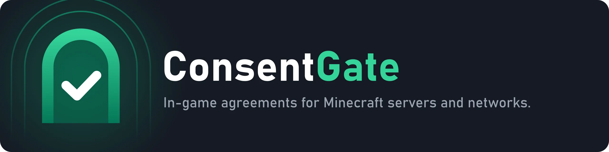
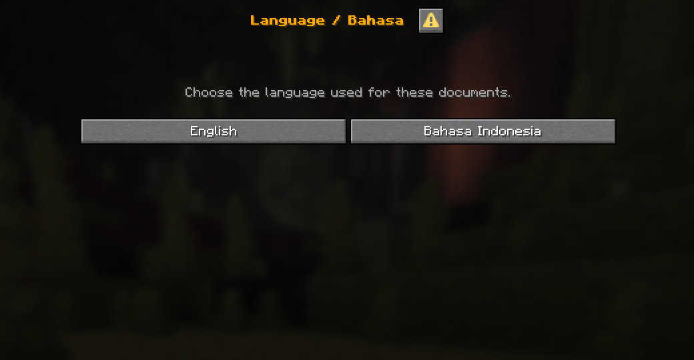
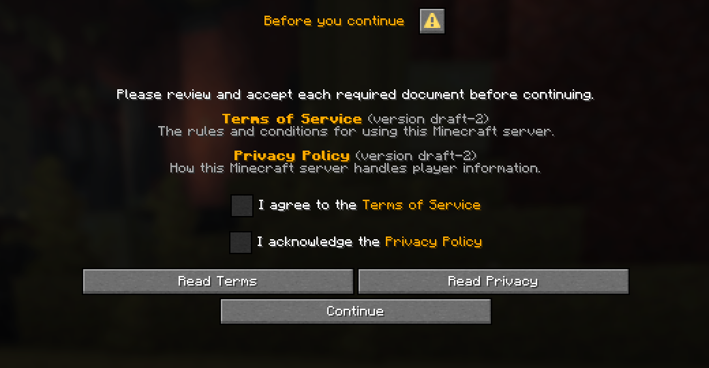
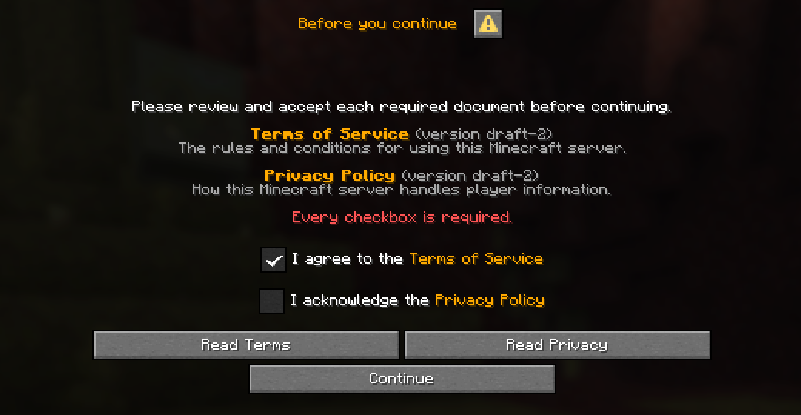
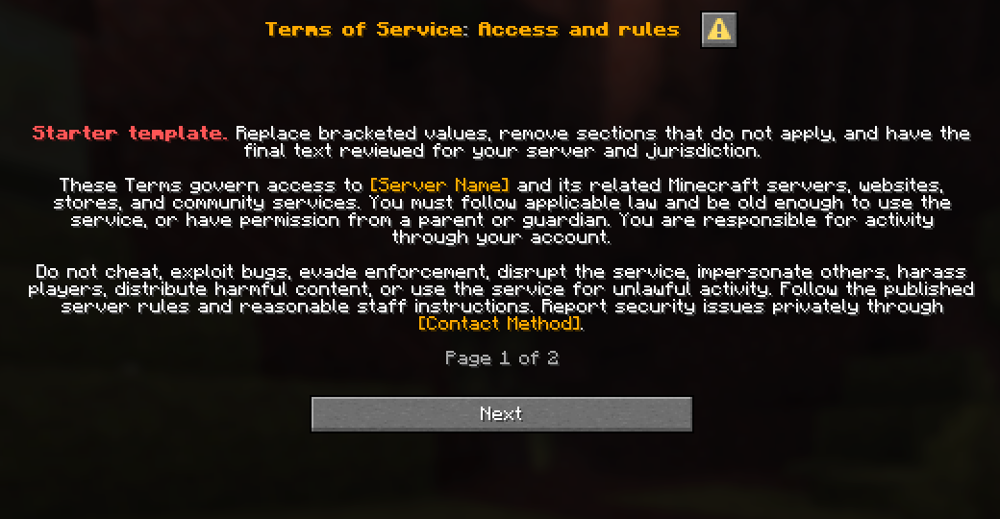

# ConsentGate

Configurable in-game agreements for Minecraft servers and networks.

ConsentGate shows rules, policies, and other documents to players before they are admitted, and only lets them in after they accept. Documents live in local files with their own titles, text, translations, and versions. No website or extra hosting is needed.

- **Velocity:** players accept before any backend connection.
- **Paper:** players accept before entering the world.
- Java dialogs, plus native Bedrock forms through Geyser.
- SQLite by default, or MySQL/MariaDB to share consent across servers.

## Screenshots

| Language selection | Required agreements |
| --- | --- |
|  |  |
| **Missing agreement warning** | **Reading a document** |
|  |  |

## Requirements

| Platform | Needs |
| --- | --- |
| Velocity | Java 21+, Minecraft Java 1.21.6+ clients, and [PacketEvents](https://github.com/retrooper/packetevents) 2.13.0 on the same proxy |
| Paper | Java 21+, Paper 1.21.7+, Minecraft Java 1.21.6+ clients |
| Bedrock (optional) | [Geyser](https://geysermc.org/download) on the same proxy or server |

## Quick start

1. Download the JAR for your platform from [releases](https://github.com/kaizen-network/ConsentGate/releases) and put it in `plugins/` (with PacketEvents on Velocity).
2. Start once. The gate starts disabled and creates its config and starter documents.
3. Edit `documents/terms.yml.example` and `documents/privacy.yml.example`, then rename them to end in `.yml`.
4. Set `enabled: true` in `config.yml`.
5. Run `consentgate validate`, then `consentgate reload` in the console.

The starter documents are templates. Review and adapt them before use.

## Documentation

- [Overview](docs/index.md)
- [Installation](docs/installation.md)
- [Configuration](docs/configuration.md)
- [Writing documents](docs/documents.md)
- [Player experience](docs/player-experience.md)
- [Commands and permissions](docs/commands.md)
- [Storage](docs/storage.md) and [MySQL/MariaDB](docs/remote-storage.md)
- [Backups and recovery](docs/backups.md)
- [Compatibility](docs/compatibility.md)
- [Troubleshooting](docs/troubleshooting.md)
- [Changelog](CHANGELOG.md)

Working on ConsentGate itself? See [contributing](docs/contributing/README.md).

## License

GNU General Public License v3.0 only (`GPL-3.0-only`). See [LICENSE](LICENSE). Dependencies keep their own licenses; see [THIRD_PARTY_NOTICES.md](THIRD_PARTY_NOTICES.md).
